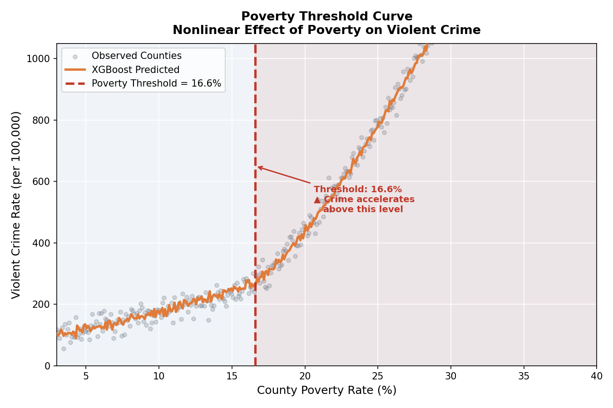
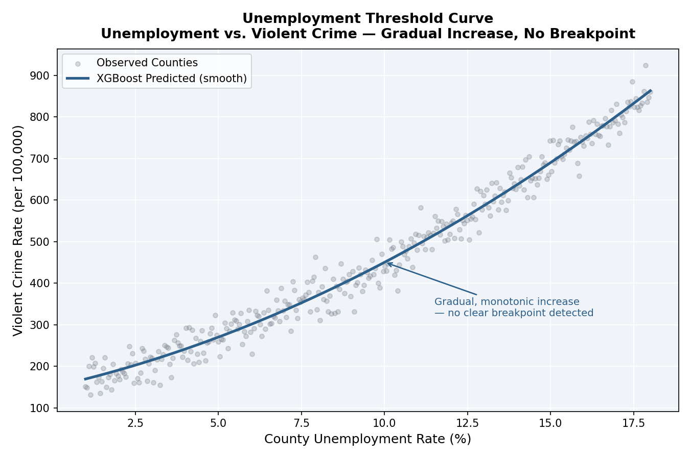

# Poverty Thresholds and Violent Crime: Evidence of Nonlinear Socioeconomic Distress Across the United States

## Overview





This project investigates whether the two most correlated variables with crime, ooverty and unemployment, influence violent crime at a constant rate across U.S. counties or whether threshold effects arise when communities reach sufficiently high levels of socioeconomic distress.

For this purpose, I use county-level crime data and socioeconomic indicators from the American Community Survey (ACS), and then compare traditional econometric models with machine learning approaches to identify nonlinear relationships and potential tipping points.

The central finding is that poverty exhibits a threshold effect around **16.6%**, beyond which predicted violent crime rates increase substantially more rapidly. Unemployment, however, displays a positive but more gradual relationship with crime.

## Research Question

> Do poverty and unemployment predict violent crime at a constant rate, or do threshold effects emerge once counties reach sufficiently high levels of socioeconomic distress?

## Data Sources

### Crime Data
- FBI Uniform Crime Reporting (UCR) Program
- County-level violent crime rates per 100,000 residents

### Socioeconomic Data
- American Community Survey (ACS) 2023
- Poverty rate
- Unemployment rate
- Median household income
- Educational attainment

### Final Sample
- 3,123 U.S. counties

## Methods

### Traditional Statistical Models
- Ordinary Least Squares (OLS)
- Nonlinear OLS Specifications
  - Quadratic models
  - Quintile-based models

### Machine Learning Models
- Random Forest
- XGBoost

### Model Interpretation
- SHAP (SHapley Additive exPlanations)
- Threshold Detection Analysis

## Main Findings

- Poverty is the strongest predictor of county-level violent crime.
- Machine learning models outperform linear regression in predictive accuracy.
- A poverty threshold emerges at approximately **16.6%**.
- Counties above this threshold experience substantially higher predicted violent crime rates.
- Unemployment is positively associated with crime but does not exhibit a comparable breakpoint.

## Repository Structure

```text
## Repository Structure

```text
.
├── code/
│   ├── 01_data_preprocessing.py
│   ├── 02_workflow_eda.py
│   └── 03_analysis.py
│
├── data/
│   ├── raw/
│   └── processed/
│
├── output/
│   ├── crime_hist.png
│   ├── ols_coefficients.png
│   ├── model_comparison.png
│   ├── shap_importance.png
│   ├── poverty_threshold_curve.png
│   └── unemployment_threshold_curve.png

```

## Key Results

### Model Performance

| Model | Test R² |
|---------|---------|
| OLS | 0.101 |
| Random Forest | 0.197 |
| XGBoost | 0.207 |


### Poverty Threshold

- Estimated threshold: **16.6% poverty**
- Predicted crime rates increase sharply beyond this level
- Evidence of a nonlinear relationship between poverty and violent crime


## Author

Luis Ortiz Velasquez  
Dartmouth College  
QSS 45 – AI and Machine Learning for Social Science
